<div align="center">


<br/>


<br/>

**"Monitors the world. Simulates the future. Validates its own predictions."**

*A real-time global intelligence platform that fuses OSINT monitoring with multi-agent predictive simulation — where every agent is a BEAM process and the knowledge graph forgets, decays, and evolves like a living system.*

<br/>

> [!IMPORTANT]
> Zeitgeist combines the best of **[WorldMonitor](https://github.com/koala73/worldmonitor)** (real-time OSINT) and **[MiroFish](https://github.com/666ghj/MiroFish)** (swarm intelligence), rewritten from scratch in **Gleam** for type safety, fault isolation, and actor-model concurrency that neither TypeScript nor Python can match.

</div>

---

## ⚡ Quick Start

```bash
# Clone
git clone https://github.com/gabrielmaialva33/zeitgeist.git
cd zeitgeist

# Build & test
gleam build
gleam test    # 236 tests, 0 failures

# Run
gleam run     # Starts on http://localhost:4000
```

```bash
# Health check
curl http://localhost:4000/api/health

# Recent events
curl http://localhost:4000/api/events

# Country risk score
curl http://localhost:4000/api/risk/cii/UA

# Knowledge graph entity
curl http://localhost:4000/api/graph/entity/iran

# Active simulations
curl http://localhost:4000/api/worlds

# Predictions
curl http://localhost:4000/api/predictions
```

---

## 🏗️ Architecture

```mermaid
%%{init: {'theme': 'dark', 'themeVariables': {'primaryColor': '#e94560', 'primaryTextColor': '#fff', 'primaryBorderColor': '#e94560', 'lineColor': '#8892b0', 'secondaryColor': '#1a1a2e', 'tertiaryColor': '#16213e', 'edgeLabelBackground': '#0d1117'}}}%%
graph TD
    A[🌐 Signal Sources] -->|RSS, ADS-B, AIS, USGS, ACLED| B[📡 Event Bus]
    B --> C[🧠 Knowledge Graph]
    B --> D[⚠️ Risk Engine]
    B --> E[🎭 Swarm Simulation]
    D -->|RiskAlerts| B
    D -->|Extreme anomaly| E
    E -->|Agent actions| C
    E --> F[🔮 Prediction Engine]
    F -->|Validate vs reality| B
    F -->|Feedback loop| E
    B --> G[🌐 Web API + WebSocket]

    style A fill:#0f3460,stroke:#e94560
    style B fill:#1a1a2e,stroke:#e94560
    style C fill:#16213e,stroke:#e94560
    style D fill:#1a1a2e,stroke:#e94560
    style E fill:#16213e,stroke:#e94560
    style F fill:#0f3460,stroke:#e94560
    style G fill:#1a1a2e,stroke:#e94560
```

<div align="center">



</div>

The system runs as a **single BEAM application** where each engine communicates via typed `Subject(msg)` channels — zero shared mutable state, full fault isolation.

| Layer | What it does |
|:------|:------------|
| **Signal** | Ingests real-world data from 6 sources (RSS, seismic, conflict, market, military) |
| **Knowledge Graph** | ETS-backed temporal store with dual-time facts, decay, conflict resolution |
| **Risk Engine** | CII scoring, 14 correlation patterns, anomaly detection, cascade modeling |
| **Swarm** | Thousands of autonomous agents as BEAM processes with personality & memory |
| **Prediction** | ReACT tools, scenario generation, validation feedback loop |
| **Web** | REST API + WebSocket streaming |

---

## 🧠 Knowledge Graph

Inspired by state-of-the-art research (2025-2026):

| Paper | Innovation | Applied |
|:------|:----------|:--------|
| **ATOM** (2025) | Dual-time modeling | Each fact has `observed_at` + `valid_from/until` |
| **TG-RAG** | Bi-level temporal hierarchy | Hour/Day/Month/Year index for O(1) queries |
| **T-GRAG** | Temporal conflict resolution | Weighted scoring resolves contradictions |
| **MemoTime** (WWW 2026) | Memory-augmented reasoning | Agents query graph with temporal context |
| **LHGstore** (Mar 2026) | Learned graph indexing | Adaptive indexing for hot entities |

```gleam
pub type AtomicFact {
  AtomicFact(
    id: String,
    subject: String,          // entity_id
    predicate: RelationKind,  // Allied, Hostile, Sanctions...
    object: String,           // entity_id or value
    observed_at: Int,         // when the system learned this
    valid_from: Int,          // when the fact became true
    valid_until: Option(Int), // None = still valid
    confidence: Float,        // 0.0-1.0
    source_credibility: Float,
    frequency: Int,           // how many sources confirm
  )
}
```

**Decay formula:** `weight = max(floor, confidence * e^(-ln2/half_life * age) * boost)`

| Relation | Half-life | Floor | Why |
|:---------|:----------|:------|:----|
| Hostile, Allied | 7 days | 0.2 | Geopolitical relations persist |
| TradePartner | 30 days | 0.1 | Trade is stable |
| LocatedIn | 365 days | 0.5 | Geography rarely changes |
| Default | 48 hours | 0.05 | News is ephemeral |

---

## 🎭 Swarm Simulation

Each agent is a **BEAM process** — lightweight, fault-isolated, concurrent by nature.

```gleam
pub type AgentKind {
  GovernmentAgent(country: String, role: GovRole)
  MilitaryAgent(country: String, branch: Branch)
  TraderAgent(style: TradingStyle, portfolio: Float)
  Citizen(country: String, demographics: Demographics)
  JournalistAgent(outlet: String, bias: Float)
  InfluencerAgent(platform: String, followers: Int)
  CorporationAgent(sector: String, market_cap: Cap)
}
```

**3 Decision Tiers:**

| Tier | Backend | Who | Memory |
|:-----|:--------|:----|:-------|
| **Elite** | Cloud LLM (Claude/GPT) | Heads of state, CEOs | 1000 facts |
| **Standard** | Ollama local (7-13B) | Journalists, officials | 200 facts |
| **Reactive** | Rule-based (no LLM) | Citizens, algo traders | 50 facts |

**4 Platforms:** SimDiplomatic (government channels), SimTwitter (public timeline), SimReddit (threaded discussions), SimMarket (order book)

**Personality (SWA — Socially-Weighted Alignment):**

```gleam
pub type Personality {
  Personality(
    openness: Float,          // Big Five OCEAN
    conscientiousness: Float,
    extraversion: Float,
    agreeableness: Float,
    neuroticism: Float,
    conformity: Float,        // influenced by neighbors
    contrarianism: Float,     // goes against majority
    risk_appetite: Float,     // market behavior
    hawkishness: Float,       // dove <-> hawk spectrum
    influence_radius: Int,
    trust_network: Dict(String, Float),
  )
}
```

---

## ⚠️ Risk Engine

### Country Instability Index (CII)

Based on **VIEWS** (PRIO/Uppsala) conflict prediction model:

```
cii = baseline_risk * 0.4 + event_score * 0.6

event_score = conflict * 0.30 + unrest * 0.25 + security * 0.20 + information * 0.25
```

### 14 Correlation Patterns

| Pattern | What it detects |
|:--------|:---------------|
| VelocitySpike | Event rate >3x baseline |
| Triangulation | Same entity in 3+ streams |
| NewsLeadsMarket | News spike -> price move (15-60min) |
| MilitarySurge | Military activity >3 sigma |
| PredictionLeadsNews | Prediction precedes confirming news |
| SilentDivergence | CII rising, market ignoring |
| CascadeTrigger | Infrastructure failure -> market impact |
| MarketLeadsNews | Market moves before news breaks |
| DiplomaticSurge | Spike in diplomatic messages |
| MultiRegionConvergence | Same event in 3+ regions |
| SentimentMomentum | Accelerating sentiment trend |
| SupplyChainDisruption | Infra + trade + market triple hit |
| TheaterEscalation | Military concentration in theater |
| EntityFrequencySpike | Entity mentions exploding |

### Theater Posture Assessment

9 strategic theaters with **strike capability detection** (tanker + AWACS + 3 fighters):

| Theater | Elevated | Critical |
|:--------|:---------|:---------|
| Iran/Gulf | 8 aircraft | 20+ |
| Taiwan Strait | 6 | 15+ |
| Baltic | 5 | 12+ |
| Korea | 5 | 12+ |
| South China Sea | 6 | 15+ |
| East Med | 4 | 10+ |
| Israel-Gaza | 3 | 8+ |
| Yemen-Red Sea | 4 | 10+ |
| Black Sea | 4 | 10+ |

### Infrastructure Cascade (I³ Paper)

BFS propagation: `impact = edge_weight * disruption * (1 - redundancy)` — max depth 3 hops.

---

## 🔮 Prediction & Validation

The **feedback loop** is what makes Zeitgeist unique:

```
Real events -> seed simulation -> agents predict -> validate vs reality -> evolve agent weights
```

**ReACT Tools:** QueryGraph, RiskSnapshot, InterviewAgent (LLM responds in character)

**Validation:** Confirmed predictions boost agent credibility. Refuted ones penalize. Natural selection for better predictions.

---

## 📡 Signal Sources

| Source | Data | Protocol |
|:-------|:-----|:---------|
| Reuters RSS | World news | HTTP + XML parse |
| AP News RSS | Breaking news | HTTP + XML parse |
| USGS | Earthquakes M4.5+ | REST API |
| ACLED | Armed conflict events | REST API |
| Market feeds | Crypto, stocks | REST/WebSocket |
| ADS-B | Military aircraft | REST API |

---

## 🌐 API

| Method | Endpoint | Description |
|:-------|:---------|:------------|
| GET | `/api/health` | Service health check |
| GET | `/api/events` | Recent 50 events |
| GET | `/api/risk/cii/:country` | Country instability score |
| GET | `/api/graph/entity/:id` | Entity + related facts |
| GET | `/api/worlds` | Active simulations |
| GET | `/api/worlds/:id` | World detail |
| GET | `/api/predictions` | Active prediction scenarios |
| WS | `/ws/events` | Real-time event stream |

---

## 📂 Project Structure

```
zeitgeist/
├── src/zeitgeist/
│   ├── core/           # Event bus, types, config, ETS, geo
│   ├── graph/          # Temporal knowledge graph (7 modules)
│   ├── risk/           # Intelligence analysis (8 modules)
│   ├── signal/         # Data ingestion (7 modules + FFI)
│   ├── swarm/          # Simulation engine (8 modules)
│   ├── agent/          # Autonomous agents (7 modules)
│   ├── predict/        # Prediction & validation (4 modules)
│   ├── llm/            # LLM abstraction (4 modules)
│   └── web/            # HTTP + WebSocket (3 modules)
├── test/               # 236 tests, 41 files
└── gleam.toml
```

---

## 📊 Stats

| Metric | Value |
|:-------|:------|
| **Language** | Gleam -> Erlang/BEAM |
| **Source files** | 63 (60 Gleam + 3 Erlang FFI) |
| **Test files** | 41 |
| **Tests** | 236 passed, 0 failures |
| **Engines** | 9 (core, graph, risk, signal, swarm, agent, predict, llm, web) |
| **Correlation patterns** | 14 |
| **Agent types** | 7 |
| **Simulation platforms** | 4 |
| **Strategic theaters** | 9 |

---

## 🛠️ Development

```bash
gleam build     # Build
gleam test      # Test (236 tests)
gleam run       # Run on :4000
gleam format    # Format code
```

<details>
<summary><b>Environment Variables</b></summary>

```bash
# Required
ZEITGEIST_API_KEY=your-secret-key

# Optional
ZEITGEIST_PORT=4000
OLLAMA_URL=http://localhost:11434
OLLAMA_MODEL=llama3.1:8b
ANTHROPIC_API_KEY=...
OPENAI_API_KEY=...
```

</details>

---

## 📚 Research Foundation

Built on cutting-edge research (2025-2026):

- **ATOM** (2025) — Dual-time modeling for temporal knowledge graphs
- **TG-RAG** — Bi-level temporal graph framework
- **T-GRAG** — Temporal conflict resolution in GraphRAG
- **MemoTime** (WWW 2026) — Memory-augmented temporal KG reasoning
- **LHGstore** (Mar 2026) — In-memory learned graph storage
- **WarAgent** (ICLR 2025) — LLM-based multi-agent war simulation
- **SWA** (2026) — Socially-Weighted Alignment for multi-agent LLMs
- **VIEWS** (PRIO/Uppsala) — ML conflict forecasting 3 years ahead
- **I³** — Interdependent infrastructure cascade modeling
- **"Fog of War"** (Mar 2026) — LLM reasoning in live geopolitical crisis

---

## 📜 License

MIT License — [Gabriel Maia](https://github.com/gabrielmaialva33)

---

<div align="center">


*"The zeitgeist doesn't just observe the present — it simulates the future and validates its own prophecies."*

<br/>

**[gabrielmaialva33](https://github.com/gabrielmaialva33)**

</div>
